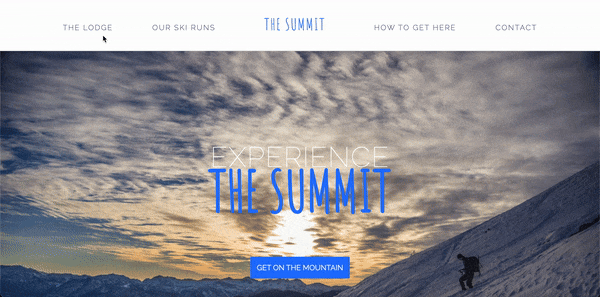

# The Summit: Mountain Resort Booking Website

"Welcome to The Summit, your premier destination for booking unforgettable mountain resort experiences. Explore our curated selection of top-rated resorts nestled amidst breathtaking peaks, offering unparalleled adventure and relaxation for your next getaway."

**Link to project:** https://hamza-musa.github.io/TheSummit/

 

## How It's Made:

**Tech used:** HTML, CSS

Crafting Summit: A Journey into Building a Mountain Resort Booking Website with HTML and CSS
Introduction
Summit represents our endeavor to create a straightforward yet visually captivating platform for booking mountain resort getaways. Fueled by our love for the outdoors and a passion for web development, we embarked on a journey to bring this concept to life using the fundamentals of HTML and CSS.

Conceptualization and Planning
The idea for Summit originated from our desire to provide an accessible online resource for travelers seeking mountain retreats. Through brainstorming sessions and sketching wireframes, we outlined the core features and visual aesthetics essential for capturing the essence of mountain adventures.

Development Process
Utilizing HTML for structuring and CSS for styling, we meticulously crafted Summit's user interface to convey the rugged beauty of mountain landscapes. From designing responsive layouts to incorporating subtle animations, every aspect of Summit's development was guided by our commitment to simplicity and elegance.

User Experience Design
Despite the simplicity of our tech stack, we prioritized user experience at every stage of Summit's design. Clear navigation, intuitive booking forms, and captivating imagery were seamlessly integrated to immerse visitors in the allure of mountain retreats.

Challenges and Solutions
Building Summit with HTML and CSS presented its own set of challenges, from ensuring cross-browser compatibility to optimizing performance on different devices. Through experimentation and perseverance, we discovered innovative solutions and best practices to overcome these obstacles without compromising the integrity of our design.

Future Enhancements
While Summit may have been built using HTML and CSS, our journey is far from over. We envision integrating JavaScript for interactive elements and exploring server-side technologies to enhance Summit's functionality and user experience further. With each enhancement, Summit will continue to evolve as the go-to platform for mountain resort bookings.

Conclusion
Summit is not just a website; it's a testament to our dedication to merging technology with our love for the great outdoors. By harnessing the power of HTML and CSS, we've created a platform that inspires wanderlust and facilitates unforgettable mountain adventures. Join us as we continue to refine and expand Summit, unlocking new possibilities for mountain enthusiasts around the globe.

## Optimizations

As I continue to develop Summit, I'm eager to explore new ways to optimize performance and enhance the user experience. Leveraging JavaScript, I plan to implement techniques, ensuring faster page load speeds and smoother navigation for users. Additionally, I'm excited to focus on refining Summit's UI/UX design, aiming to make it even more intuitive and engaging. In the future, I'm looking forward to implementing server-side rendering for dynamic content, integrating real-time updates for availability and pricing, and expanding Summit's geographic coverage to reach a broader audience of mountain enthusiasts. Moreover, I'm keen to introduce features such as personalized recommendations, social sharing, and community integration to enhance user engagement and foster a vibrant online community around Summit. With a proactive approach to optimization and innovation, I'm confident that Summit will continue to evolve as the premier destination for unforgettable mountain getaways.

## Lessons Learned:

Embracing Continuous Learning
Building Summit was not just a technical endeavor; it was a journey of continuous learning and growth. Throughout the development process, we encountered numerous challenges and opportunities for innovation, each of which provided valuable insights and lessons. From mastering new technologies to refining our problem-solving skills, every step of the journey reinforced the importance of embracing lifelong learning as engineers.

Celebrating Milestones and Achievements
Amidst the complexities of software development, it's crucial to pause and celebrate the small victories along the way. Whether it's overcoming a particularly challenging bug, implementing a new feature, or achieving a performance optimization breakthrough, these moments of triumph serve as powerful reminders of our capabilities and fuel our passion for creating exceptional experiences through code.
